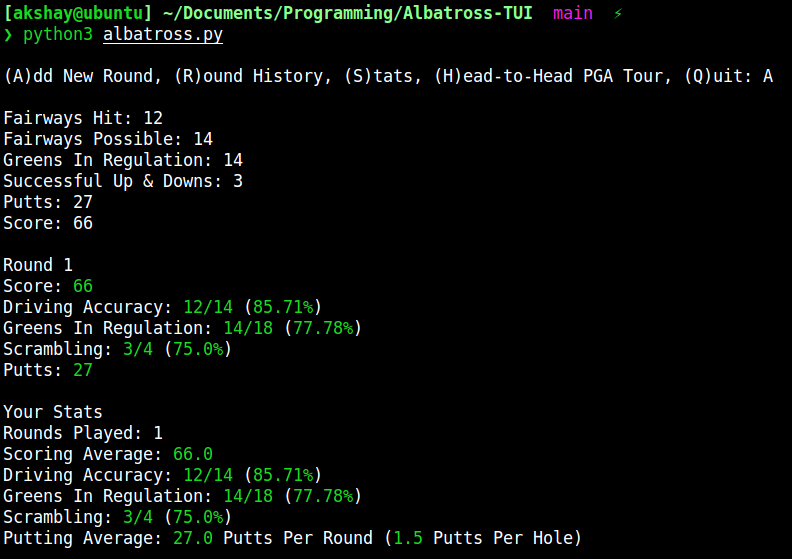
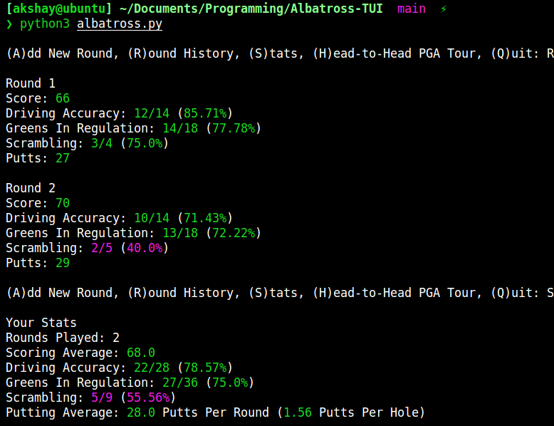
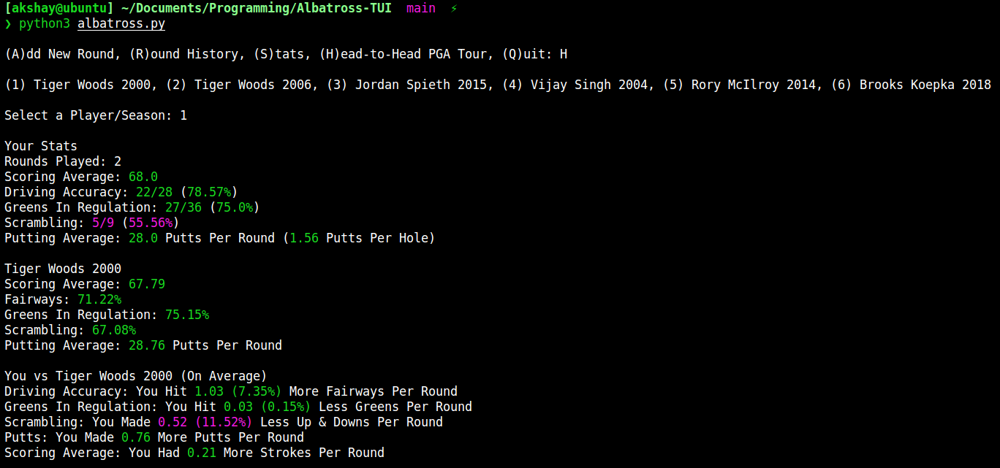

# Albatross
Golf Stat Analyzer

---

Copyright 2022, Akshay R. Kapadia 
License: GPL-3.0 
Version: 0.1.0 
Status: Development 

---

## Features

- Color coded stats based on PGA Tour average
- Track round by round stats
    - Fairways Hit
    - Greens in Regulation
    - Up & Downs
    - Putts
    - Score
- Track overall stats
    - Rounds Played
    - Scoring Average
    - Driving Accuracy
    - Greens in Regulation
    - Scrambling
    - Putts per Round
    - Putts per Hole
- Compare your stats to the PGA Tour average or some of the best players in the world
    - Tiger Woods 2000
    - Tiger Woods 2006
    - Jordan Spieth 2015
    - Vijay Singh 2004
    - Rory McIlroy 2014
    - Brooks Koepka 2018

---

## Stat Color Meanings

- Green: above PGA Tour average or better than player in head-to-head
- Yellow: Close to PGA Tour average or player in head-to-head
- Red: Below PGA Tour average or worse than player in head-to-head

---

## Command Screenshots

**(A)dd New Round**

**(R)ound History & (S)tats**

**(H)ead-to-Head PGA Tour**

