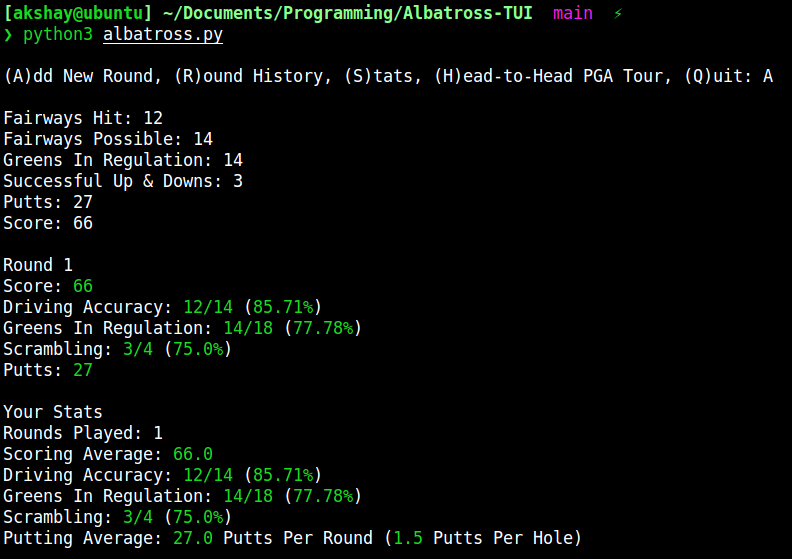
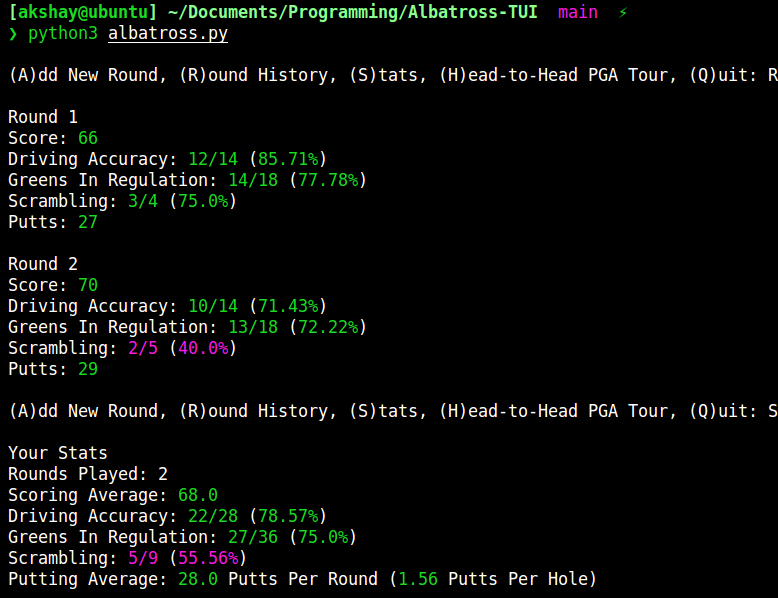
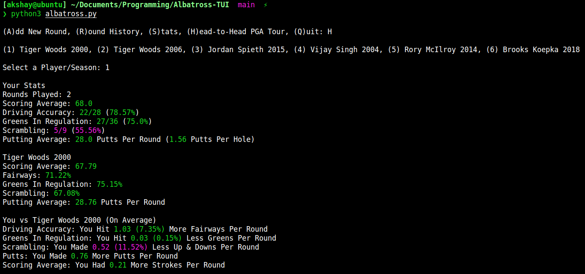

# Albatross
Golf Stat Analyzer

## Stat Color Meanings

- Green: above PGA Tour average or better than player in head-to-head
- Yellow: Close to PGA Tour average or player in head-to-head
- Red: Below PGA Tour average or worse than player in head-to-head

## Command Screenshots

**(A)dd New Round**

**(R)ound History & (S)tats**

**(H)ead-to-Head PGA Tour**

